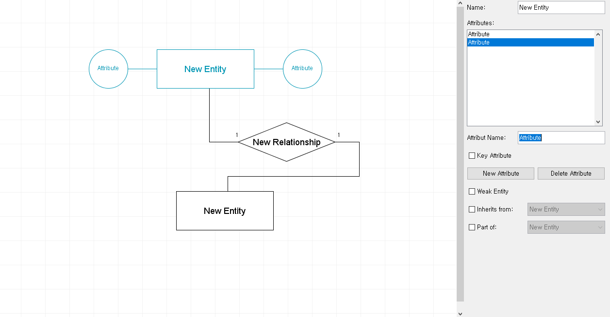
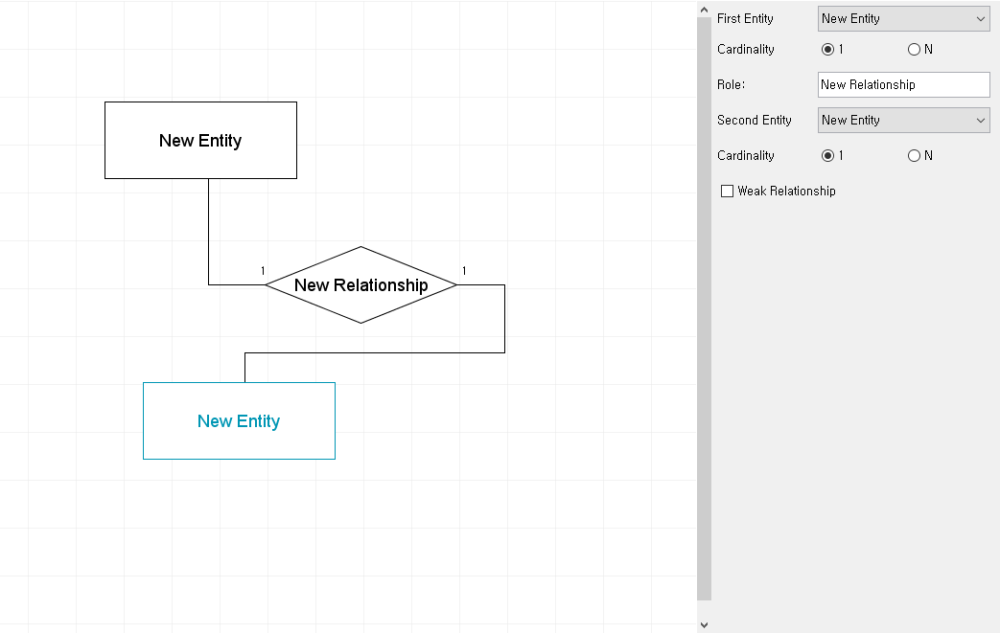
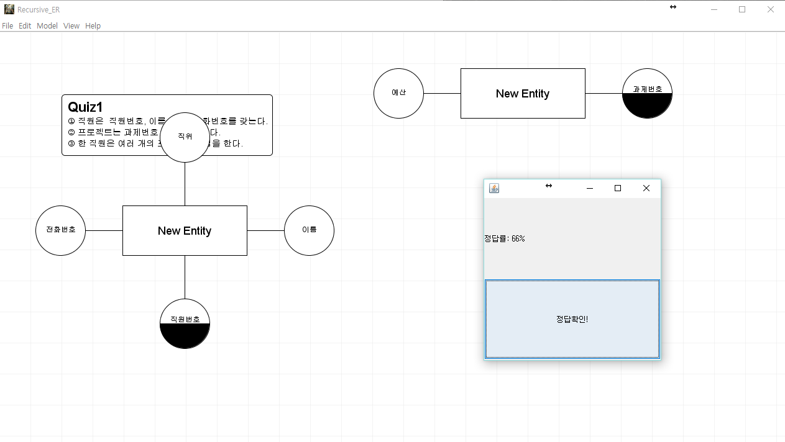
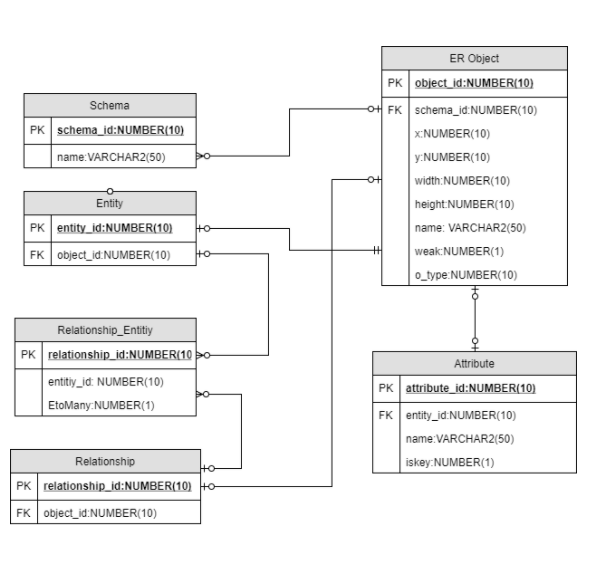

# ER 다이어그램(Recursive ER)
___
## about 
어플리케이션을 제작하기 위해서 데이터의 저장 및 관리를 담당하는 데이터베이스의 사용 및 관리는 필수적이다. 그러나 이와같은 데이터베이스의 관리 만큼 데이터베이스의 설계를 정교하게 하는 것 또한 중요하다. 우리는 데이터베이스의 설계를 위해 릴레이션의 ER다이어그램을 그리게 되는데 주로  draw.io를 활용하여 데이터 베이스를 설계한다. 하지만 Draw.io는 입문자가 데이터베이스를 설계하기에는 불필요한 기능이 많고 웹기반이기 때문에 오프라인에서 사용하기 힘들다. 이에 우리는 Draw.io의  단점을 개선하고, 데이터 베이스 설계를 처음 입문 하는 사람들을 위해  간단히 모델링 가능하고, 데이터 베이스 설계 능력을 향상시킬 수 있는 모델링 툴을 만들기로 했다. 

## 설치 가이드

1. 티베로를 가동한다음 tbadmin에 접속한다.
1. 아래의 쿼리문을 이용하여 ER user 문을 추가한다.
1. tool/import에서 [.dat](resources/RecursiveER.dat) 파일을 import한다.(resources파일 내의 RecursiveER.dat를 실행한다.)
1. 이클립스에서 JDBC를 추가한 후에 실행한다.

### .dat 파일 오류시 대처
* [script](resources/script.sql)을 실행한다.


### user ER addition

```
CREATE user ER IDENTIFIED BY tibero DEFAULT TABLESPACE USR;
GRANT CONNECT, RESOURCE TO ER;
```

### Tibero JDBC 추가 방법

1. 자바 프로젝트 우클릭
1. Build Path
1. Configure Build Path
1. Libraries 탭
1. Add External JARs 
1. Tibero JDBC 확인


### 인코딩 오류시 대처

1. ER-Editor 프로젝트 마우스 오른쪽 클릭
1. Properties클릭
1. Resource에서 에서 Text file encoding 에서 Other UTF-8


## usage
___

### 엔티티

1.엔티티 추가
* 엔티티는 다음과 같은 방법으로 추가 가능하다.
	1. 더블클릭
	1. 단축키(Ctrl+Shift+E)
	1. 메뉴(Model)

2.엔티티 조작
* 엔티티는 드래그로 이동이 가능하다.
* 클릭을 통하여 다음과 같이 엔티티를 조작할 수 있다.
	1. 이름부여
	1. 에트리뷰트 추가 및 이름 수정
	1. 약한 엔티티로의 변경

3.엔티티 삭제
* 엔티티는 delete버튼을 통하여 삭제가 가능하다.



### 릴레이션

1.릴레이션 추가
* 릴레이션는 다음과 같은 방법으로 추가 가능하다.
	1. 릴레이션을 형성 하고자 하는 엔티티 더블클릭 
	1. 단축키(Ctrl+Shift+R)
	1. 메뉴(Model)
	
2.릴레이션 조작
* 클릭을 통하여 다음과 같이 릴레이션를 조작할 수 있다.
	1. 이름부여
	1. 연결된 카디날리티의 수 변경
	1. 약한 릴레이션으로의 변경
	
3.릴레이션 삭제
* 릴레이션은 delete버튼을 통하여 삭제가 가능하다.

### 저장

* 저장은 다음과 같은 형식을 가능하다.
	1. 자체적인 포멧
	1. 이미지 포멧(png,jpeg등)
	1. sql 포멧
	


### 퀴즈 



* 퀴즈는 메뉴를 통해 실행 가능하다.
* 문제를 보고 상황에 맞게 다이어그램을 추가한 후 채점 버튼을 누르면 정답의 비율을 알려준다.
	
### menu structure

* File
	* New ER diagram(Ctrl+N)
	* Load quiz 1(Ctrl+Q)
	* Save & export
		* Save as ERD &
		* Save as image(jpeg,png...)
		* Save to database
	* Open (Ctrl+O)
	* Close (Ctrl+W)
	
* Edit
	* Undo(Ctrl+Z)
	* Redo(Ctrl+Shift+N)
	* Cut(Ctrl+X)
	* Copy(Ctrl+C)
	* Paste (Ctrl+V)
	* Select All(Ctrl+A)
	* Delete (Delete)
	
* Model
	* Add Entity (Ctrl+Shift+E)
	* Add Relationship (Ctrl+Shift+R)
	* Add Description Box (Ctrl+Shift+R)

* View
	*Original size (Ctrl+0)
	* Zoom In (Ctrl+Minus)
	* Zoom Out (Ctrl+Plus)
	* Compress (Ctrl+Shift+Minus)
	* Expand (Ctrl+Shift+Plus)
	
* Help
	* Show Help
	* About

	
	
## database structure




## requirement
* java
* tibero(oracle호환)
* tibero jdbc

## references

[ER-Editor](https://github.com/palle-k/ER-Editor)

## [LICENSE](LICENSE)
